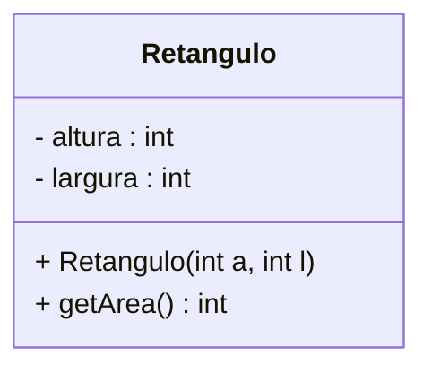
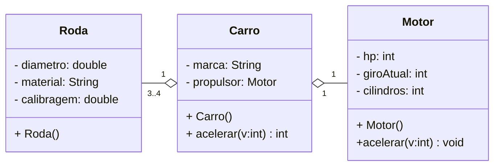
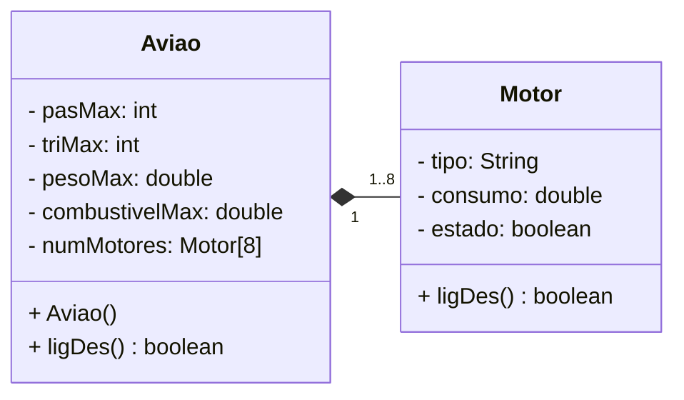
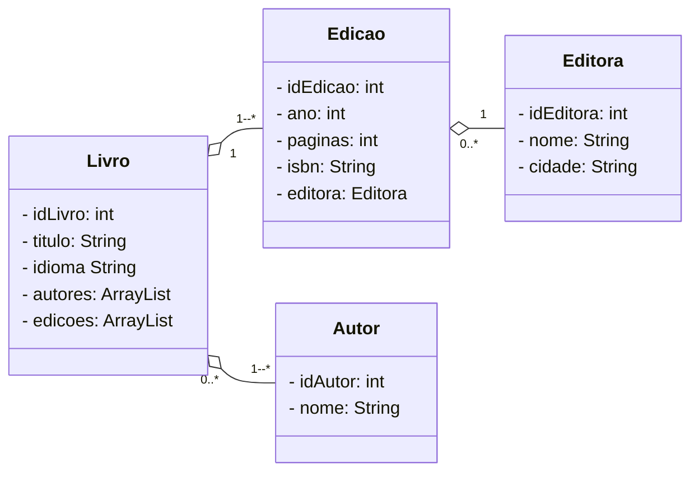

```mermaid
classDiagram
    direction LR
    
    class Retangulo {
        - altura : int
        - largura : int
        + Retangulo(int a, int l)
        + getArea() int
    }
```

```mermaid
classDiagram
    direction LR
    
    class Carro {
        - marca: String
        - propulsor: Motor
        + Carro()
        + acelerar(v:int) int
    }
    
    class Motor{
        - hp: int
        - giroAtual: int
        - cilindros: int
        + Motor()
        +acelerar(v:int) void
    }
    
    class Roda {
        - diametro: double
        - material: String
        - calibragem: double
        + Roda()
    }
    
    Carro "1"o--"1" Motor
    Roda "3..4"--o"1" Carro
```

```mermaid
classDiagram
    direction LR
    
    class Aviao {
        - pasMax: int
        - triMax: int
        - pesoMax: double
        - combustivelMax: double
        - numMotores: Motor[8]
        + Aviao()
        + ligDes() boolean
    }
    
    class Motor {
        - tipo: String
        - consumo: double
        - estado: boolean
        + ligDes() boolean
    }
    
    Aviao "1"*--"1..8" Motor
```

```mermaid
classDiagram
    direction LR
    
    class Livro {
        - idLivro: int
        - titulo: String
        - idioma String
        - autores: ArrayList<Autor>
        - edicoes: ArrayList<Edicao>
    }
    
    class Edicao {
        - idEdicao: int
        - ano: int
        - paginas: int
        - isbn: String
        - editora: Editora
    }
    
    class Editora {
        - idEditora: int
        - nome: String
        - cidade: String
    }
    
    class Autor {
        - idAutor: int
        - nome: String
    }

    Livro "0..*" o-- "1--*" Autor
    Livro "1" o-- "1--*" Edicao
    Edicao "0..*" o-- "1" Editora
```